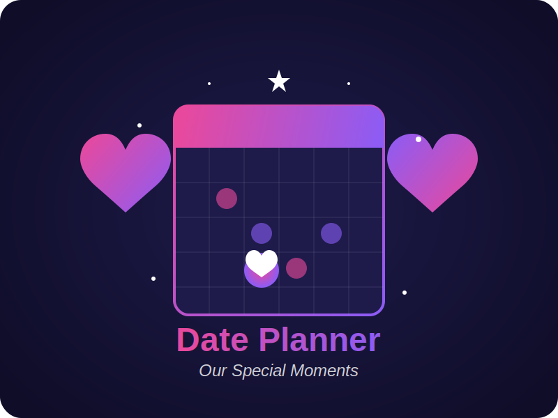

# 💖 Romantic Date Planner

<div align="center">
  

  <p align="center">
    <em>A heartfelt application designed to create the perfect date with someone special</em>
  </p>
  
  <p align="center">
    
    
    
    
  </p>
</div>

## ✨ Overview

This romantic date planner application was created as a special gift to plan the perfect date with someone you love. With an elegant and intuitive interface, it provides a customized experience to help create meaningful moments together.

The application guides users through a series of personalized questions about date preferences, creating a thoughtfully curated plan that can be saved and shared.

## 🌟 Features

- **Personalized Experience**: Addresses users by their chosen name for a personal touch
- **Interactive Questions**: Beautiful animated interface for selecting date preferences
- **Step-by-Step Planning**: Guides through various aspects of the date (activities, time, food, etc.)
- **Romantic UI**: Elegant dark theme with soft purple and pink highlights
- **Custom SVG Logo**: Beautiful calendar and heart-based logo that captures the essence of the application
- **Summary Creation**: Generates a beautiful summary of the date plan
- **Downloadable Memories**: Save the date plan as an image to share or remember

## 🚀 Technologies Used

<div align="center">
  <table>
    <tr>
      <td align="center"><br>React</td>
      <td align="center"><br>Tailwind CSS</td>
      <td align="center"><br>Vite</td>
      <td align="center"><br>JavaScript</td>
    </tr>
    <tr>
      <td align="center"><br>HTML5</td>
      <td align="center"><br>CSS3</td>
      <td align="center"><br>npm</td>
      <td align="center"><br>Git</td>
    </tr>
  </table>
</div>

## 📦 Installation

1. Clone the repository:

   ```bash
   git clone https://github.com/yourusername/ariana-luna.git
   cd ariana-luna
   ```

2. Install dependencies:

   ```bash
   npm install
   ```

3. Start the development server:

   ```bash
   npm run dev
   ```

4. Open your browser and navigate to:
   ```
   http://localhost:5173
   ```

## 🎯 How It Works

1. **Welcome Screen**: Enter a name to be addressed throughout the experience
2. **Activity Selection**: Choose from various date activities (dinner, coffee, walk, etc.)
3. **Time Planning**: Select the day and time for your date
4. **Customization**: Answer questions about food preferences, activities, and more
5. **Summary**: Review your perfect date plan and download it as an image
6. **Ending**: A delightful conclusion to the planning experience

## 🎭 Components

- **Header**: Welcoming screen with name input
- **Question**: Dynamic question cards with animated options
- **Summary**: Beautiful recap of all selected choices
- **Ending**: Confirmation and closing animation
- **Footer**: Application footer with credits

## 💕 Motivation

This project was created as a testament to love and dedication, providing a heartfelt way to plan special moments with someone important. It combines technical skills with emotional meaning to create something truly unique.

## 📃 License

This project is intended for personal use. Please respect the emotional value behind it.

---

<div align="center">
  <p>Made with ❤️ for my special someone</p>
</div>
