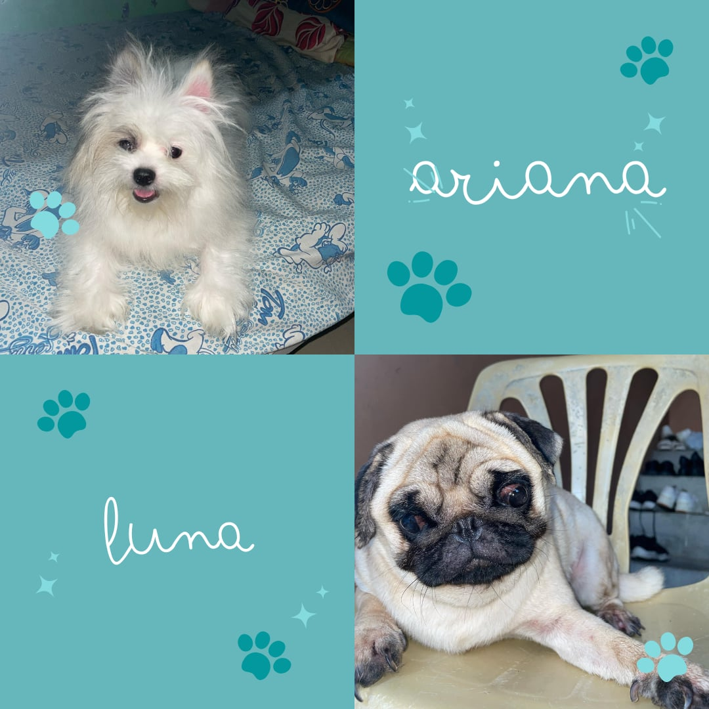

<h1 align="center">Date Planner💏❤️‍🔥💋</h1>
<h3 align="center">This simple date planner web application was created with React and styled with Tailwind CSS as a special gift for my girlfriend. Designed with user-friendliness in mind, the application provides a clean and intuitive interface for planning and organizing dates, appointments, and special occasions. Users can easily add, edit, and delete events, set reminders, and view their upcoming schedules in a visually appealing calendar format. This project serves as a testament to my love and dedication, providing a helpful and personalized tool for my girlfriend to navigate her busy life with ease.</h3>

    

---

    
    
    
    
    
    
    
    
    
    
    

